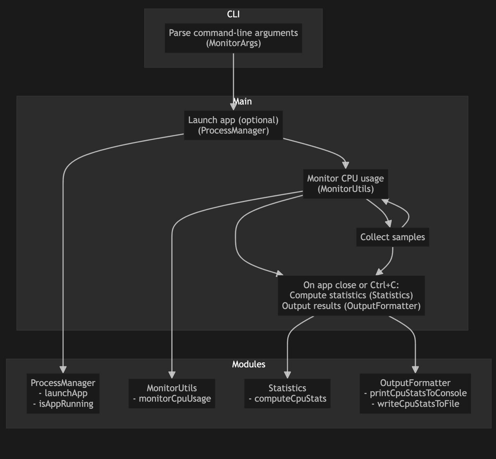

# CrossMon

CrossMon is a lightweight, cross-platform C++17 console tool for real-time system monitoring. It reports CPU usage (with planned support for memory, GPU, and NPU) and outputs results in both human-readable and machine-friendly formats.

## Features
- Monitor CPU usage for a specific app or the whole system
- Customizable sampling interval (`-i` flag)
- Output statistics to a file (`-o` flag)
- Graceful exit and stats on Ctrl+C
- Modular, extensible codebase
- Unit tested core modules

## Flow Diagram


## High-Level Design (HLD)

CrossMon is structured in a layered, modular architecture:

```
┌───────────────────────────────┐
│ Command-Line Interface (CLI)  │  ← parses flags, prints output
├───────────────────────────────┤
│ Monitor Controller            │  ← orchestrates timing & aggregation
├───────────────────────────────┤
│ Platform-Agnostic API Layer   │  ← pure C++ interfaces
├─────────┬─────────┬───────────┤
│ CPU API │ GPU API │ NPU API   │  ← abstract base classes
├─────────┼─────────┼───────────┤
│ OS-Specific Adaptors          │  ← Windows / macOS impls
└─────────┴─────────┴───────────┘
```

- **CLI Manager**: Parses arguments, builds config, formats output
- **Monitor Controller**: Initializes monitors, schedules sampling loop
- **CPU Monitor**: Calculates CPU-busy delta between two snapshots
- **Data Formatter**: Converts metrics to JSON or text
- **Process Manager**: Launches and checks app status
- **Statistics Module**: Computes peak, average, min, max

## Build Instructions

1. **Clone the repository:**
   ```sh
   git clone <your-repo-url>
   cd CrossMon
   ```
2. **Configure and build:**
   ```sh
   cmake -B build
   cmake --build build
   ```

## Usage

Monitor a specific app (e.g., Photo Booth) every 500ms:
```sh
./build/crossmon -i 500 "Photo Booth"
```

Monitor system CPU usage (no app) until Ctrl+C:
```sh
./build/crossmon -i 1000
```

Output statistics to a file:
```sh
./build/crossmon -i 500 -o results.txt "Safari"
```

## Output
- Prints live CPU usage to the console
- On exit, prints and (optionally) writes statistics: samples, peak, average, min, max

## Modular Structure
- `include/utils/` and `src/utils/`: argument parsing, monitoring, process management, statistics, output formatting
- `src/monitors/`: (planned) platform-specific monitor implementations
- `test/`: unit tests for all major modules

## Run Unit Tests
```sh
cd build
ctest
```
Or run individual test executables in `build/`.

## Planned Extensions
- Memory, GPU, and NPU monitoring
- JSON output
- Windows support

---

**CrossMon** is designed for extensibility and reliability. Contributions and suggestions are welcome!
