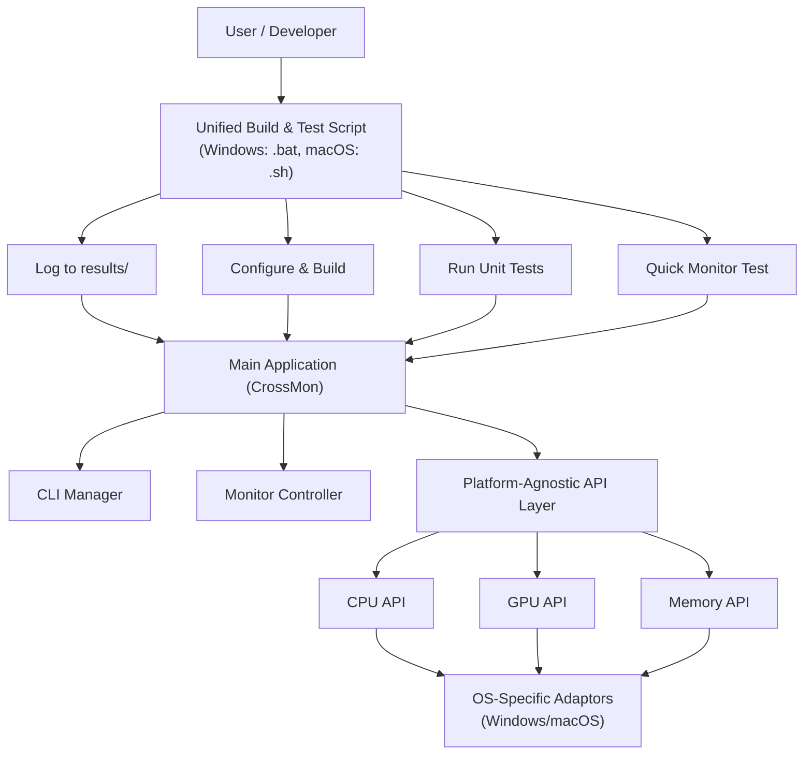

# CrossMon

CrossMon is a lightweight, cross-platform C++17 console tool for real-time system monitoring. It provides comprehensive CPU, Memory, and GPU monitoring with both human-readable console output and machine-friendly file formats.

## Requirements

### Windows
- Visual Studio 2019 or 2022 (any edition) **or** Visual Studio Build Tools 2019/2022
- CMake 3.16 or later
- Windows 10 or later

### macOS
- macOS 10.15 (Catalina) or later
- Xcode Command Line Tools (for `clang` and `make`)
- CMake 3.16 or later
- [GNU coreutils](https://formulae.brew.sh/formula/coreutils) (for `gtimeout`):
  ```sh
  brew install coreutils
  ```

## Features
- ✅ **CPU Monitoring**: Real-time CPU utilization tracking
- ✅ **Memory Monitoring**: Physical memory usage in MB and percentage
- ✅ **GPU Monitoring**: Multi-GPU detection and utilization tracking
  - Windows: WMI-based monitoring for all GPU vendors (NVIDIA, AMD, Intel)
  - macOS: IOKit-based monitoring (future implementation)
- ✅ **Cross-Platform**: Windows and macOS support
- ✅ **Application-Specific Monitoring**: Monitor system usage while specific apps run
- ✅ **Flexible Output**: Console display + file output with statistics
- ✅ **Customizable Sampling**: Adjustable monitoring intervals
- ✅ **Debug Mode**: Detailed diagnostic output for troubleshooting
- ✅ **Graceful Shutdown**: Clean exit with Ctrl+C and comprehensive statistics
- ✅ **Modern C++17**: Modular, extensible, and well-tested codebase

## High-Level Design (HLD)

CrossMon now features a unified, script-driven build and test pipeline, modular architecture, and clear separation of platform-specific and cross-platform logic.



- **Unified Build & Test Script**: Handles build, unit tests, and a quick monitor test for each platform, logging to the `results/` directory.
- **Main Application**: Modular, with CLI, controller, and platform-agnostic APIs.
- **Platform-Agnostic API Layer**: Defines interfaces for CPU, GPU, and Memory monitoring.
- **OS-Specific Adaptors**: Implement platform-specific logic for Windows and macOS.

## Quick Start with Test Scripts

For easy testing, use the provided test scripts in the `scripts/` folder:

### Windows
```cmd
# Interactive test menu
scripts\run_tests_windows.bat

# Or run specific tests
scripts\build_and_test_windows.bat     # Build and test everything
scripts\test_quick_windows.bat         # 15-second system monitor test
scripts\test_gpu_detection_windows.bat # Test GPU detection
```

### macOS
```bash
# Make scripts executable (first time only)
chmod +x scripts/*.sh

# Interactive test menu
scripts/run_tests_macos.sh

# Or run specific tests
scripts/build_and_test_macos.sh       # Build and test everything
scripts/test_quick_macos.sh           # 15-second system monitor test  
scripts/test_gpu_detection_macos.sh   # Test GPU detection
```

## Build Instructions

### Windows (Visual Studio)
1. **Prerequisites:**
   - **Visual Studio 2019/2022** (Community, Professional, or Enterprise) with C++ support
   - **Alternative**: Visual Studio Build Tools 2019/2022
   - **CMake 3.16** or later
   - **Note**: Build scripts automatically detect your VS installation

2. **Clone and build:**
   ```cmd
   git clone https://github.com/fantops/CrossMon.git
   cd CrossMon
   
   REM Build, run unit tests, and quick monitor test (Release)
   scripts\build_and_test_windows.bat release
   
   REM For Debug build
   scripts\build_and_test_windows.bat debug
   ```

### macOS
1. **Clone the repository:**
   ```sh
   git clone https://github.com/fantops/CrossMon.git
   cd CrossMon
   ```
2. **Build, run unit tests, and quick monitor test:**
   ```sh
   # For Release build
   ./scripts/build_and_test_macos.sh release

   # For Debug build
   ./scripts/build_and_test_macos.sh debug
   ```

## Usage

### Windows Examples
Monitor a specific app (e.g., Notepad) every 500ms:
```cmd
build\Release\crossmon.exe -i 500 "notepad.exe"
```

Monitor system CPU usage (no app) until Ctrl+C:
```cmd
build\Release\crossmon.exe -i 1000
```

Output statistics to a file:
```cmd
build\Release\crossmon.exe -i 500 -o results.txt "chrome.exe"
```

### macOS Examples
Monitor a specific app (e.g., Photo Booth) every 500ms:
```sh
./build/crossmon -i 500 "Photo Booth"
```

Monitor system CPU usage (no app) until Ctrl+C:
```sh
./build/crossmon -i 1000
```

Output statistics to a file:
```sh
./build/crossmon -i 500 -o results.txt "Safari"
```

## Output

### Real-time Display
CrossMon displays live system metrics in a clean, readable format:

```
System Information:
GPUs detected: 2
Monitoring system usage...
Press Ctrl+C to stop and see statistics.

CPU: 15.2% | Memory: 8192 MB (45.3%) | GPUs: 2.0%, 0.0% (avg: 1.0%)
CPU: 12.8% | Memory: 8156 MB (45.1%) | GPU: 0.0%
CPU: 18.4% | Memory: 8203 MB (45.4%) | GPUs: 1.5%, 0.0% (avg: 0.8%)
```

### Statistics Summary
On exit (Ctrl+C), comprehensive statistics are displayed:

```
=== System Monitoring Statistics ===

CPU Statistics:
  Samples: 127
  Average: 14.6%
  Peak: 28.3%
  Minimum: 8.1%

Memory Statistics:
  Average Used: 8156 MB (45.2%)
  Peak Used: 8350 MB (46.3%)
  Minimum Used: 7982 MB (44.2%)

GPU Statistics:
  GPU Count: 2
  Average Utilization: 0.8%
  Peak Utilization: 2.1%
  Minimum Utilization: 0.0%
```

### File Output
When using `-o` option, statistics are saved to the specified file for further analysis.

## Project Structure

```
CrossMon/
├── CMakeLists.txt              # Main build configuration
├── README.md                   # Project documentation
├── .gitignore                  # Git ignore rules
├── .vscode/                    # VS Code configuration
├── data/                       # Data files and resources
├── include/                    # Header files
│   ├── cpu_monitor.hpp         # CPU monitoring interface
│   ├── gpu_monitor.hpp         # GPU monitoring interface
│   ├── memory_monitor.hpp      # Memory monitoring interface
│   └── utils/                  # Utility headers
│       ├── monitor_args.hpp    # Command-line argument parsing
│       ├── monitor_utils.hpp   # Main monitoring utilities
│       ├── output_formatter.hpp # Output formatting
│       ├── process_manager.hpp # Process management
│       └── statistics.hpp     # Statistics computation
├── src/                       # Source files
│   ├── main.cpp              # Main application entry point
│   ├── macos/                # macOS-specific implementations
│   │   └── cpu_monitor_mac.cpp
│   ├── utils/                # Cross-platform utilities
│   │   ├── monitor_args.cpp
│   │   ├── monitor_utils.cpp  # Main monitoring logic
│   │   ├── output_formatter.cpp
│   │   ├── process_manager.cpp
│   │   └── statistics.cpp
│   └── windows/              # Windows-specific implementations
│       └── gpu_monitor_win.cpp # Windows GPU monitoring (WMI-based)
├── test/                     # Unit tests
│   ├── test_cpu_monitor_mac.cpp
│   ├── test_cpu_monitor_win.cpp
│   ├── test_gpu_monitor_mac.cpp  # macOS GPU monitoring tests
│   ├── test_gpu_monitor_win.cpp  # Windows GPU monitoring tests
│   ├── test_monitor_args.cpp
│   ├── test_process_manager.cpp
│   └── test_statistics.cpp
├── scripts/                  # User testing and validation scripts
│   ├── README.md            # Documentation for test scripts
│   ├── build_and_test_windows.bat  # Complete build and test pipeline
│   ├── build_and_test_macos.sh     # macOS build and test pipeline
│   ├── test_quick_windows.bat      # Quick functionality test
│   ├── test_quick_macos.sh         # Quick functionality test (macOS)
│   ├── test_gpu_detection_windows.bat  # GPU-specific testing
│   ├── test_gpu_detection_macos.sh     # GPU-specific testing (macOS)
│   ├── test_app_monitoring_windows.bat # Application monitoring test
│   ├── test_app_monitoring_macos.sh    # Application monitoring test (macOS)
│   ├── run_tests_windows.bat       # Unit test runner
│   └── run_tests_macos.sh          # Unit test runner (macOS)
├── build/                    # CMake build directory (generated)
├── build_debug/             # Debug build directory (generated)
├── build_release/           # Release build directory (generated)
└── results/                 # Test script output logs (generated)
    ├── build_and_test.log
    └── unit_tests.log
```

### Key Directories

- **`include/`**: Platform-agnostic header files defining interfaces
- **`src/utils/`**: Cross-platform implementation of core monitoring logic
- **`src/windows/`**: Windows-specific implementations (GPU monitoring via WMI)
- **`src/macos/`**: macOS-specific implementations (CPU monitoring via IOKit)
- **`test/`**: Comprehensive unit tests for all components
- **`scripts/`**: User-friendly test and validation scripts
- **`build_*.bat`**: Production and debug build scripts for Windows

### Architecture Patterns

CrossMon follows several key design patterns:

- **Interface Segregation**: Separate interfaces for CPU, GPU, and Memory monitoring
- **Platform Abstraction**: Common interfaces with platform-specific implementations
- **Factory Pattern**: Platform-specific monitor creation via factory functions
- **RAII**: Proper resource management for WMI, COM, and system handles
- **Strategy Pattern**: Different monitoring strategies for different platforms
- **Observer Pattern**: Real-time monitoring with periodic sampling

### Implementation Details

- **Windows GPU Monitoring**: Uses WMI `Win32_PerfFormattedData_GPUPerformanceCounters_GPUEngine` with DXGI adapter enumeration for LUID correlation
- **Cross-Platform CPU**: Platform-specific implementations with unified interface
- **Memory Monitoring**: Native OS APIs for accurate physical memory reporting
- **Debug Support**: Conditional compilation flags for detailed diagnostic output
- **Error Handling**: Graceful degradation when monitoring components are unavailable

## Modular Structure
- `include/utils/` and `src/utils/`: argument parsing, monitoring, process management, statistics, output formatting
- `src/monitors/`: (planned) platform-specific monitor implementations
- `test/`: unit tests for all major modules

## Building

### Quick Build, Test, and Monitor

**Windows:**
```cmd
scripts\build_and_test_windows.bat release
```

**macOS:**
```sh
./scripts/build_and_test_macos.sh release
```

- Both scripts accept `debug` or `release` as a parameter.
- They will build the project, run all unit tests, and perform a quick 15-second system monitor test.
- Logs are saved to `results/build_and_test_<build_type>.log`.

## Run Unit Tests

### Windows
```cmd
cd build
ctest -C Release
```

### macOS/Linux
```sh
cd build
ctest
```